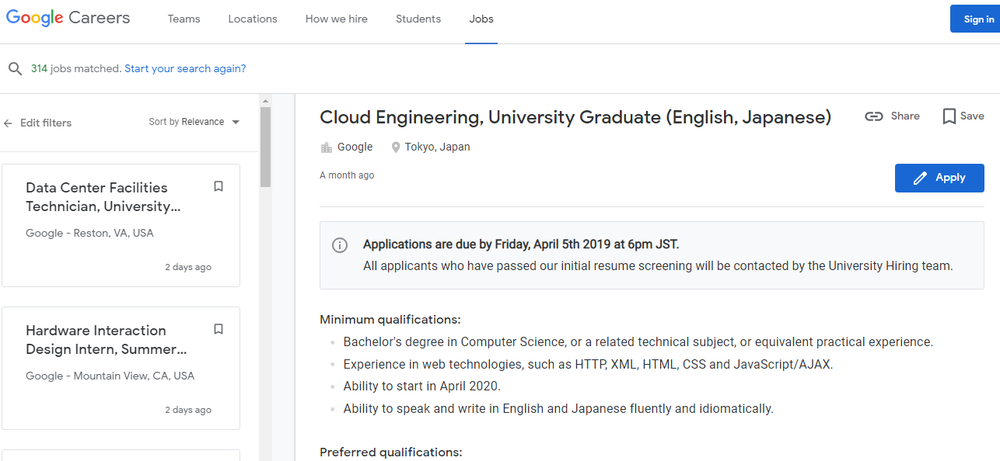

# Introduction to Information Technology

## My Profile

### Assignment 1: My Profile
This is my assignment 1 for Introduction to Information Technology, in which i have to create a profile on a website using Github.

I will be covering my personal information about myself, my interest in IT, my ideal job, my personal profile and any project ideas i have in the future.

### 1.Personal Information

My full name is Jacky Chuong, I was born on 21 of August, 2000 in Australia where i have lived all my life. I have orientated (chinese/vietnamese mix) nationality and while I don't follow any religion, I do my best to inherit any tradition in my culture. I come from a family of six, two brothers and 1 sister, with me being the third oldest. An interesting fact I also have a identical twin, Vincent, who was born thirty minutes after me. 

Right now, I have graduated from highschool and now attend to royal Melbourne Institute of Technology (RMIT) where i study Computer Studies. my student number is S3780272 and my email is s3780272@student.rmit.edu.au if you ever want to get in contact me me.

### 2.Interest in IT

**● What is your interest in IT?  When did your interest in IT start?  as there a particularevent or person that sparked your interest?Outline your IT experience (if any).**

My interest for IT started when i was very young, (around 6-7) when my family first purchase a computer for my oldest brother. Although we had only used it for games, i was fascinated by how through pixels and coding was able to create a program that was able to entertain me for hours. What spark my interest for IT was through a game called "soldat". It was a 2D shooter game in which you basically vs other players in a compact area. it was through their source code that i was able to change the stats of the weapons, from their firepower to their rate of fire. It was through games that allowed me to get into Information technology while also allowing me to do things i like (gaming and coding). As years went on with new technology being developed, my knowledge of coding and IT increases, making me the "IT guy" in primary and highschool, from importing games and programs behind administration restriction to bypassing school internet protection. While it has gotten me into trouble from time to time, (suspended from school), it was fun too see how far i can go with my knowledge. 

**● Why did you choose to come to RMIT?**

I choose to come to RMIT because I got accepted to RMIT even though i didn't study very hard for to ATAR, compared to my friends. Although i was planning to get into Computer Science, which had a requirement of a raw score of 25 for maths methods, which was my hardest subject, I did not reach my score and thus, didn't not get into the course, however i did get accepted to Computer studies which i'm glad as when i'd attended to the orientation for computer studies, i heard that computer science will require alot of maths, so luckily i dodge a bullet. :)
**● What do you expect to learn during your studies?*.

What i expect to learn throughout my time is a variety of coding and language that will help increase my knowledge for IT. 
In introduction to programming, I expect to learn the different coding structures and language and shortcuts i can use to help create my very own program. For database concept, I want to learn about the relational model and SQL language. for computer systems, I am learning the binary, decimal, octal and hexadecmial language while also learning about the logic circuit. Finally for information techonolgy, i am learning and improving my knowledge on IT and my group skills with others.

### 3.Ideal Job

[[https://careers.google.com/jobs/results/123864525557375686-cloud-engineering-university-graduate-english-japanese/?_ga=2.221673432.1536384865.1552610052-1852460904.1552610052&company=Google&company=YouTube&jex=ENTRY_LEVEL]]

My ideal job is to work in Google. In my ideal job, I will be working as a cloud engineer, in which I'll basically help customers learn how to use google products while also solving any techincal issue they have. I will also be working in a team, from web developers to system administrators to help Google's business and products grow. What appeals me to this job is that I will be working on the "front lines", meaning that i will be their consultant and their engineering expert in any issues they have. what also appeals is that I will have the opportunity to develop my own programs and assets that assist or benefit the customers while also improve any product feature that google currently has.

Some requirements for this job are:
-Bachelor's degree in Computer Science, or a related technical subject.
-Experience in web technologies, such as HTTP, XML, HTML, CSS and JavaScript/AJAX
-Ability to speak and write in English and Japanese fluently and idiomatically
-Business savvy with effective customer service skills, demonstrated through project work whilst at university, internships and/or other outside interests.
Currently, I do not have a bachelor's degree in computer science, but once I have finish my three years in Uni and get my bachelors, I will be able to reach this requirement. Another requirement is to learn japanese which i currently do not know. However, I do have some experience in web technologies, with HTML and javascript which may help me get this job. i also have some customer skills in which i can communicate with them and understand what they need/ require.
How i will be obtaining those requirements is first to complete my bachelor degree of computer studies. Secondly i will learn more web technologies such as HTTP and CSS while also improving my knowledge for HTML and Javascript. Lastly I can learn japanese and improve my customer skills in the process.

### 4.Personal Profile

