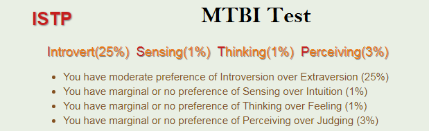

# Introduction to Information Technology

## My Profile

### Assignment 1: My Profile
This is my assignment 1 for Introduction to Information Technology, in which i have to create a profile on a website using Github.

I will be covering my personal information about myself, my interest in IT, my ideal job, my personal profile and any project ideas i have in the future.

### 1.Personal Information

My full name is Jacky Chuong, I was born on 21 of August, 2000 in Australia where i have lived all my life. I have orientated (chinese/vietnamese mix) nationality and while I don't follow any religion, I do my best to inherit any tradition in my culture. I come from a family of six, two brothers and 1 sister, with me being the third oldest. An interesting fact I also have a identical twin, Vincent, who was born thirty minutes after me. 

Right now, I have graduated from highschool and now attend to royal Melbourne Institute of Technology (RMIT) where i study Computer Studies. my student number is S3780272 and my email is s3780272@student.rmit.edu.au if you ever want to get in contact me me.

### 2.Interest in IT

**● What is your interest in IT?  When did your interest in IT start?  as there a particularevent or person that sparked your interest?Outline your IT experience (if any).**

My interest for IT started when i was very young, (around 6-7) when my family first purchase a computer for my oldest brother. Although we had only used it for games, i was fascinated by how through pixels and coding was able to create a program that was able to entertain me for hours. What spark my interest for IT was through a game called "soldat". It was a 2D shooter game in which you basically vs other players in a compact area. it was through their source code that i was able to change the stats of the weapons, from their firepower to their rate of fire. It was through games that allowed me to get into Information technology while also allowing me to do things i like (gaming and coding). As years went on with new technology being developed, my knowledge of coding and IT increases, making me the "IT guy" in primary and highschool, from importing games and programs behind administration restriction to bypassing school internet protection. While it has gotten me into trouble from time to time, (suspended from school), it was fun too see how far i can go with my knowledge. 

**● Why did you choose to come to RMIT?**

I choose to come to RMIT because I got accepted to RMIT even though i didn't study very hard for to ATAR, compared to my friends. Although i was planning to get into Computer Science, which had a requirement of a raw score of 25 for maths methods, which was my hardest subject, I did not reach my score and thus, didn't not get into the course, however i did get accepted to Computer studies which i'm glad as when i'd attended to the orientation for computer studies, i heard that computer science will require alot of maths, so luckily i dodge a bullet. :)

**● What do you expect to learn during your studies?**

What i expect to learn throughout my time is a variety of coding and language that will help increase my knowledge for IT. 
In introduction to programming, I expect to learn the different coding structures and language and shortcuts i can use to help create my very own program. For database concept, I want to learn about the relational model and SQL language. for computer systems, I am learning the binary, decimal, octal and hexadecmial language while also learning about the logic circuit. Finally for information techonolgy, i am learning and improving my knowledge on IT and my group skills with others.

### 3.Ideal Job

[[https://careers.google.com/jobs/results/123864525557375686-cloud-engineering-university-graduate-english-japanese/?_ga=2.221673432.1536384865.1552610052-1852460904.1552610052&company=Google&company=YouTube&jex=ENTRY_LEVEL]]

My ideal job is to work in Google. In my ideal job, I will be working as a cloud engineer, in which I'll basically help customers learn how to use google products while also solving any techincal issue they have. I will also be working in a team, from web developers to system administrators to help Google's business and products grow. What appeals me to this job is that I will be working on the "front lines", meaning that i will be their consultant and their engineering expert in any issues they have. what also appeals is that I will have the opportunity to develop my own programs and assets that assist or benefit the customers while also improve any product feature that google currently has.

Some requirements for this job are:
-Bachelor's degree in Computer Science, or a related technical subject.
-Experience in web technologies, such as HTTP, XML, HTML, CSS and JavaScript/AJAX
-Ability to speak and write in English and Japanese fluently and idiomatically
-Business savvy with effective customer service skills, demonstrated through project work whilst at university, internships and/or other outside interests.
Currently, I do not have a bachelor's degree in computer science, but once I have finish my three years in Uni and get my bachelors, I will be able to reach this requirement. Another requirement is to learn japanese which i currently do not know. However, I do have some experience in web technologies, with HTML and javascript which may help me get this job. i also have some customer skills in which i can communicate with them and understand what they need/ require.
How i will be obtaining those requirements is first to complete my bachelor degree of computer studies. Secondly i will learn more web technologies such as HTTP and CSS while also improving my knowledge for HTML and Javascript. Lastly I can learn japanese and improve my customer skills in the process.

### 4.Personal Profile

**● What do the results of these tests mean for you?**

From these results, it tells me that i'm a introvert, logical and practical person whos a visual learner. In the Big five test, the results displays me as a person who uses logical and rational thinking to solve everyday problems. In the learning style, it presents me as a visual learner that learns better through seeing things. Lastly, MBTI test depicts me as a "person who explores with their hands and eyes", as a person who ain't afraid to create/start something new.

**● How do you think these results may influence your behaviour in a team?**

From the result of those three test, it shows that i will use a more logical approach rather than a emotional approach when discussing problems/issues. The result also says that I need "personal space", that is being comfortable and contributing in a group while also having time for myself. the result also displays that i may "act too soon" meaning i will go over the top, such as 'suddenly change their plans because something more interesting came up'.

**● How should you take this into account when forming a team?**

What i should take account when forming a team is to watch my actions. While it is important to talk to my team about our project, i would need to focus only on the plan and try not to make things diffcult or suddenly change it. I would also have to watch out of my emotion in case it gets in the way off our work and i would also make the effort to communicate and offer help to my team whenever i'm available.

### 5.Project plan

**Overall**

My ideal project plan is to create my very own personal AI bot that will help in everyday use. While I know there's already artificial bot like Siri for apple or Alexa for Amazon, i wish to create my own AI in which that benefits me and is able to develop and learn throughout time. This AI will able to learn through my past search history, internet history and lifestyle. My AI will also respond to any questions via voice chat, is able to contact anyone through my contact list on my phone and is able to able to list daily needs such as what day it is, the weather, events, etc. 

**Motivation**

The reason i want to create a personal AI is that I want a bot that will grow along side with you. This bot is will be able to learn about you throughout its time, making it easier in your daily life. As technology grows and becomes more relevant , AI will be part of essential lifestyle, and with the creation of AI, it will be able to be with us 24/7, from our homes to our portable devices(phone), that way, if we are ever in trouble, we can use the AI to help us through our problems or contact the right person to do so.

**Description**

This AI will have the latest features and will always be updated throughout time, therefore it doesn't need to by brought again. Some features it will have are:

-**Internet**: This feature will allow the AI to search any article or things that the user has requested. Internet is also the main requirement to connect to a cloud network to save and recieve data. Internet also allows the AI to search anything on the web.

-**Speech recognition**: this feature will allow certain user to use the AI, protecting any information that the AI currently has. The Speech recognition will also allow the user to speak to the AI to search for things rather than typing it on the keyboard, thus saving time.

-**GPS/navigation system**: why this feature is not as important as others, As the AI is portable and is able to transfer to their phone, it will help the user go to their destination quicker while also displaying traffic reports.

-**Satellite connection**: this features allow the AI to connect to the satellite, allowing to boost connection to any main provider in their country. 

-**Deep Learning Space (motherboard)**: this feature is the brain of the AI, as any information is presented to the AI, the AI saves and stores the data into its learning space, searches for the answer and presents it to the user while also learning more about the user.

-**Security and Surveillance**: this feature will allow the user's data and information to be protected by the AI. the AI will have the latest firewall and security, making sure that no threats will harm the user's information or life.

-**24/7 Support**: this feature will allow the user to contact support about their AI or if they are ever in need of emergency, the Ai provides emergency services 24/7 that can be contacted through the AI.

This AI will also provide services for user in their daily lives. These services are not significant but allow a more easier/relaxing lifestyle.

-**Music Streaming Services**: This service will be connected to third party service and will allow user to listen to music either from the AI itself or to connected electronics (T.V, phone, Speakers).

-**Weather**: This will allow user too see the weather for this week, allowing them to prepare for the upcoming days.

-**Social Media Connection**: This service will allow the user to connect to their social media, no matter where they are. This allow the user to post their status anywhere, chat to their friends and family anywhere or just browse their feed.

-**Streaming Service**: This Service will allow the user to watch any streaming services that is offered. this allows the user to watch from their TV to their phone or even on the AI.

**Tools and Technologies**

Hardware that is needed to help run this AI is a **Motherboard**, to receive and save information, **Wifi Connection**, to connect to the information, **Speakers**, to respond to the user if needed, **Screen**, to display any information that the user has requested, **Microphone**, for the user to speak into and **keyboard**, if the user decides to type instead of speaking.

Some sofware that AI will need to run are, **language proccessor**, this allows the AI to understand all language, **Machine learning**, allows the Ai to learn through data and information, **Embedded AI**, this allows the AI to have standard information before learning more through the user. This AI will be run by javascript.

**Skills Required**

Some skills required are:
-Source Code Languages: to be able to code out how the AI will act and respond to certain response/action
-Biometric: This will be able to tracks the user's behaviour and can learn from it, allowing the AI to grow.
these skills are essential to creating a AI, however it will take a lengthy time to learn the language while also implementing the language into to the AI. This will be a difficult task as it will require more than one person to code the AI, as there is more than one field to focus on (communication, data storage, presenting information, third-party programs, gathering data, etc)

**Outcome**

If this project becomes successful, it will not only make me rich but also make people lives better, by making their daily routine easier. This will impact nearly everyone as not only can it be used for personal but also for business, as this AI could listening to music to gathering information about their client's request. This project will take a long time to prepare and create, but if it works out, the impact will be enormous, changing lives for the better. 

### Reference

16Personalities. (2019). ISTP Personality (“The Virtuoso”) | 16Personalities. [online] Available at: https://www.16personalities.com/istp-personality [Accessed 29 Mar. 2019].
